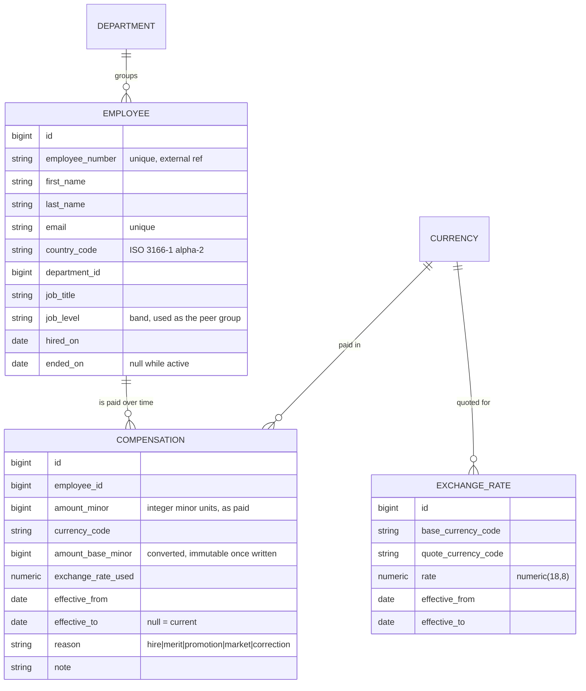

# Architecture

How the system is put together, and why. Decisions are recorded with the alternatives that were
rejected, since the rejected option is usually the more informative half.

---

## 1. System shape

```
┌─────────────────────────────┐         ┌──────────────────────────────────┐
│  web/  React + TypeScript   │         │  api/  Rails 7.1 (API mode)      │
│                             │  JSON   │                                  │
│  · Employee directory       │ ──────► │  Controllers  (thin, HTTP only)  │
│  · Employee detail+history  │ ◄────── │  Queries      (read paths)       │
│  · Compensation analytics   │  HTTP   │  Commands     (write paths)      │
│                             │         │  Models       (domain rules)     │
│  Server-driven pagination   │         │                                  │
└─────────────────────────────┘         └────────────────┬─────────────────┘
                                                         │
                                                ┌────────▼─────────┐
                                                │   PostgreSQL     │
                                                │  aggregation in  │
                                                │  SQL, not Ruby   │
                                                └──────────────────┘
```

Two deployables. The UI holds no domain rules — it renders what the API computes. Every figure a
user sees is produced by one SQL query, so the number on screen and the number in a CSV export
cannot drift apart.

## 2. Domain model



`Employee` holds identity and placement. `Compensation` holds everything that changes over time.
That split is the whole design: an employee's pay is not an attribute of the employee, it is a
series of dated facts about them.

---

## 3. Key decisions

### ADR-1 — Money is stored as integer minor units

**Context.** Salaries are summed, averaged and converted across currencies.

**Decision.** Store `amount_minor` as a `bigint` (1 234.56 EUR → `123456`) alongside an explicit
`currency_code`. Never a float.

**Consequences.** All arithmetic is exact. Rounding happens once, deliberately, at conversion and
at display. An amount is meaningless without its currency, so the two always travel together.

**Rejected.** `float`/`double` — binary floating point cannot represent 0.1 exactly, and errors
compound across 10,000 rows. `decimal` would be correct but invites accidental float coercion in
Ruby and hides the currency question.

---

### ADR-2 — Compensation is effective-dated; amounts are never mutated

**Context.** The requirement is that a salary change must never destroy the previous value.

**Decision.** Each `Compensation` row carries `effective_from` and `effective_to`. The current
record is the one with `effective_to IS NULL`. Recording a change closes the open record by setting
its `effective_to`, then inserts a new one.

Integrity is enforced in the database, not just in Ruby:

- a `GiST` exclusion constraint prevents two compensation periods for the same employee from
  overlapping;
- a partial unique index on `(employee_id) WHERE effective_to IS NULL` guarantees exactly one
  current record per employee.

**Consequences.** "Current salary" is an indexed lookup rather than a sort-and-take-first. No
amount is ever overwritten — only a period is closed — so history is a by-product of normal use.
A correction is itself a dated record with `reason = correction`, which means mistakes are visible
rather than erased.

**Rejected.** *A `salary` column on `employees`* — destroys history on every update; the original
problem. *Pure append-only with no `effective_to`* — philosophically cleaner, but every read needs
`DISTINCT ON` or a window function, which makes the hot path (the 10,000-row directory) markedly
more expensive, and overlapping periods become impossible to constrain in the database.

---

### ADR-3 — Historical rates, and why that makes denormalisation safe

**Context.** Comparing or summing salaries across countries requires a common currency.

**Decision.** Convert each compensation at the exchange rate effective on its **own**
`effective_from` date, not at today's rate. Rates live in an effective-dated table, seeded rather
than fetched from a live API.

**Consequences.** Reported figures are reproducible — last year's payroll cost does not move
because the market moved today. Tests are deterministic and run offline.

This choice then unlocks a performance property. Because a compensation's date never changes, and
the rate for that date never changes, **the converted amount is immutable once written**. So
`amount_base_minor` is computed at write time and stored. The usual objection to denormalisation —
cache invalidation — does not apply, because there is no event that could invalidate it.

The directory can therefore sort and filter on a single indexed integer column, and analytics can
aggregate without joining to rates at all. A correctness decision paid for itself in speed.

The `exchange_rate_used` is stored alongside so any converted figure can be explained and audited.

**Cost, stated honestly.** Changing the organisation's base currency requires a backfill migration.
That is a rare, deliberate, offline operation, and an acceptable price.

**Rejected.** *Live FX API* — non-deterministic tests, network dependency, and historical figures
that drift daily. *Convert on read at today's rate* — same drift problem, plus a rate join on every
query.

---

### ADR-4 — Aggregation happens in SQL

**Context.** Analytics must answer questions over the full population.

**Decision.** Every aggregate — totals, medians, percentiles, distributions — is expressed as SQL.
Medians use Postgres `percentile_cont(...) WITHIN GROUP (ORDER BY ...)`. No endpoint loads the
dataset into Ruby objects.

**Consequences.** Response time is governed by the index, not by object allocation. 10,000
`ActiveRecord` instances cost far more in memory and GC than the query itself costs in Postgres.

**Rejected.** *Ruby-side `map`/`sum`* — readable at 10 rows, indefensible at 10,000, and it makes
the "how do we pay people?" page the slowest part of the product. *Materialised rollups* — the
right answer at a million employees, premature at ten thousand; noted in the improvements list.

---

### ADR-5 — Thin controllers, with queries and commands as objects

**Context.** The two interesting operations are a filtered read and a transactional write.

**Decision.** Controllers parse HTTP and nothing else.

| Layer | Responsibility | Example |
| --- | --- | --- |
| Model | Invariants true of the record in isolation | `Compensation` rejects a non-positive amount |
| Query | Composable read paths | `EmployeeDirectoryQuery` — search, filter, sort, paginate |
| Command | Multi-step writes in a transaction | `RecordSalaryChange` — close period, convert, insert |
| Serializer | Shaping the JSON response | `EmployeeSerializer` |

**Consequences.** Each piece is unit-testable without HTTP. Filtering logic is tested directly
against the database rather than through a controller.

**Rejected.** *Fat models* — `Employee` would accumulate unrelated reporting concerns. *Logic in
controllers* — untestable without the full request cycle, and impossible to reuse for CSV export.

---

## 4. Performance approach

The directory is the hot path: 10,000 employees, filtered, sorted, paginated.

- **Server-side pagination always.** The API never returns an unbounded collection.
- **Current compensation is a partial-index lookup** (`WHERE effective_to IS NULL`), not a sort.
- **Sorting by pay uses the stored `amount_base_minor`** — one integer column, directly indexable,
  no join to rates (ADR-3).
- **Covering indexes on the real filter combinations** — country, department, job level.
- **No N+1.** The directory joins current compensation once; violations are caught by a test, not
  by inspection.

Measurements with `EXPLAIN (ANALYZE, BUFFERS)` against the full seed are recorded in
`docs/performance.md` as the queries are built, so the claims here are evidenced rather than
asserted.

## 5. Testing approach

- **RSpec + FactoryBot.** Model specs for invariants, query specs against real SQL, request specs
  for API contracts.
- **Deterministic.** Dates are frozen with `travel_to`; seeded data uses a fixed random seed. No
  test depends on today's date, on ordering luck, or on the network.
- **Fast.** Transactional cleanup, no `sleep`, no HTTP in unit tests.
- **Readable as documentation.** Test names state domain rules — "closes the previous period when a
  raise is recorded" — not mechanics.

The suite is the specification of the domain. A reader should be able to learn the rules of
compensation from the spec files alone.
