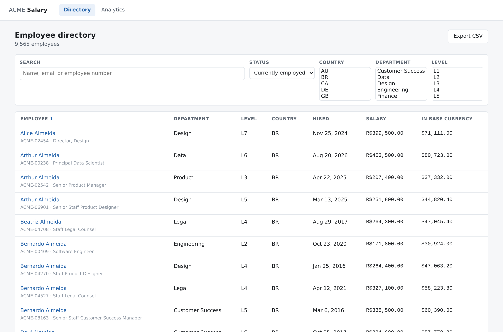
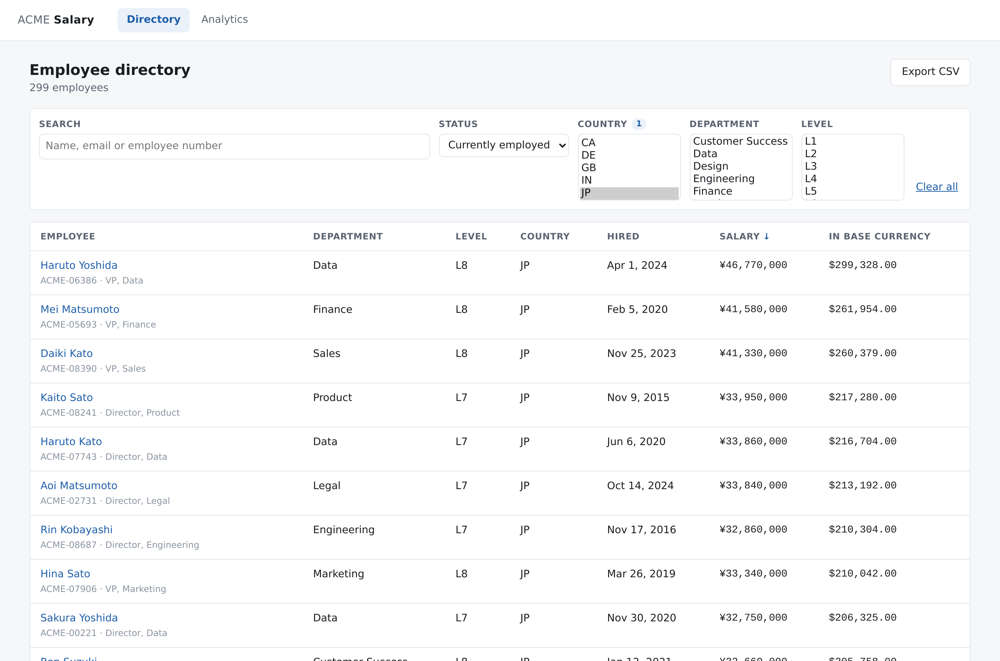
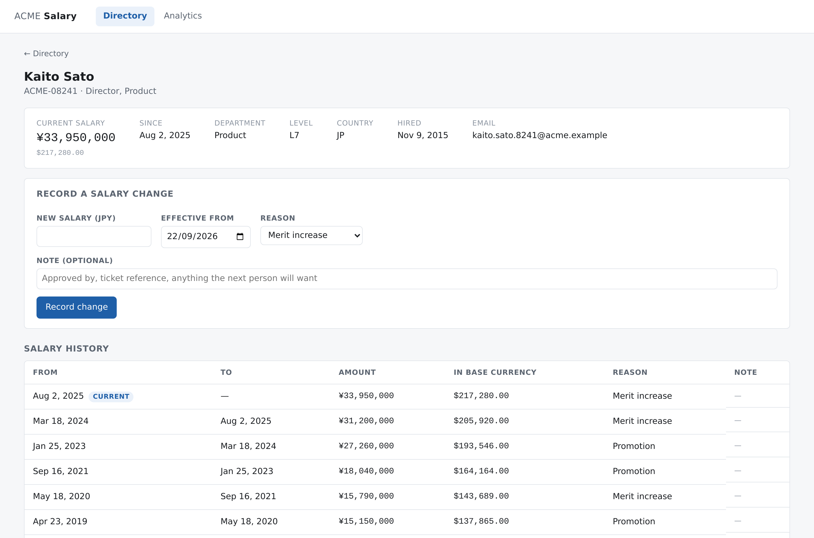
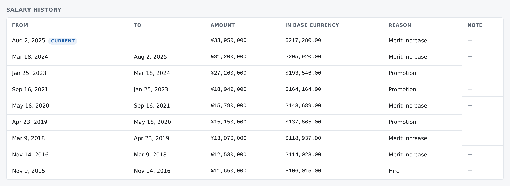
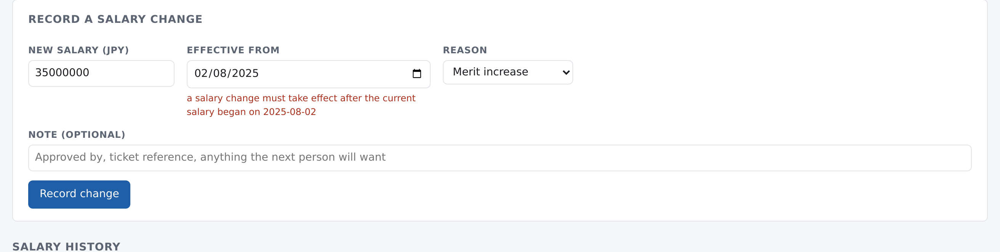
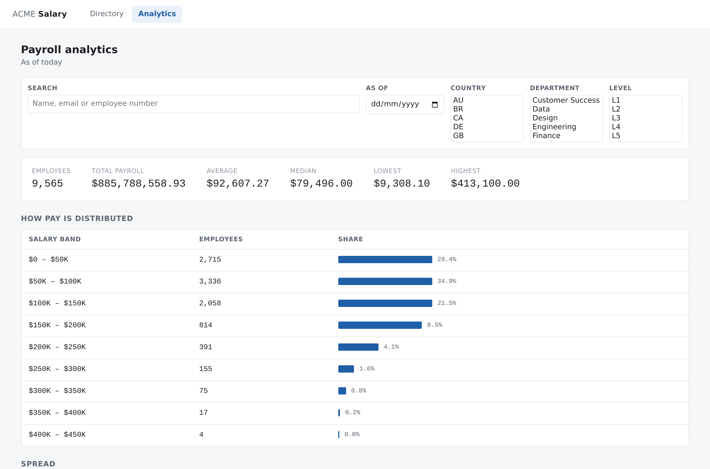
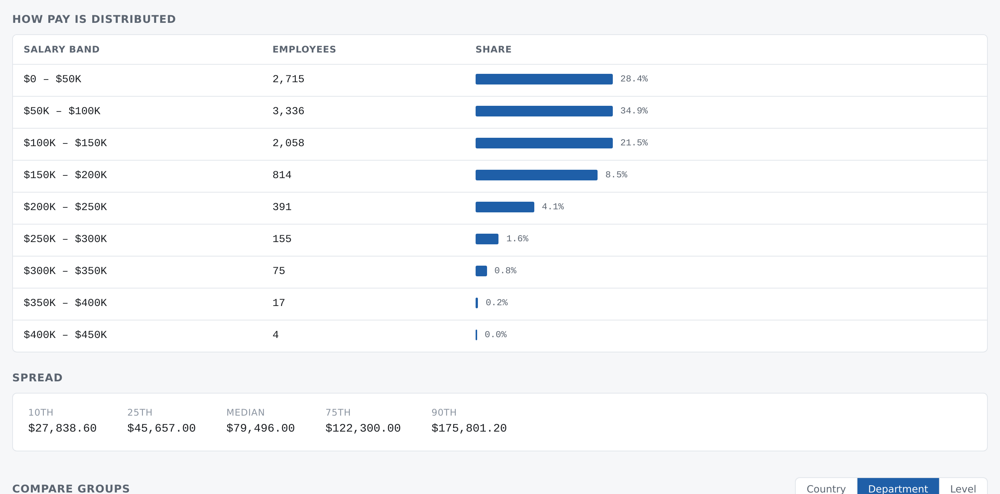
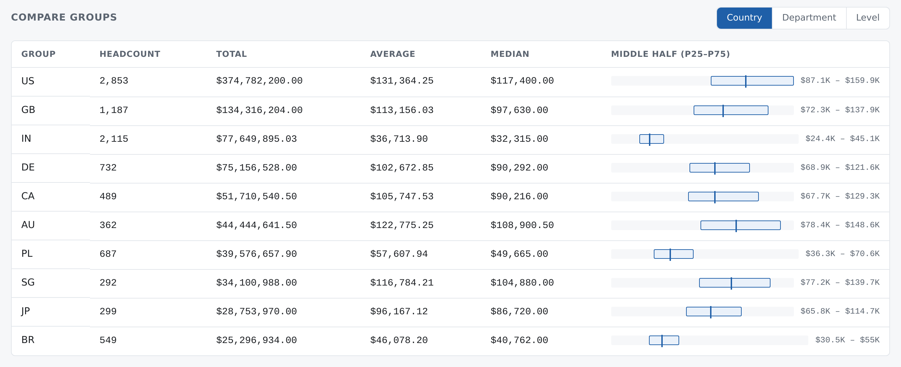
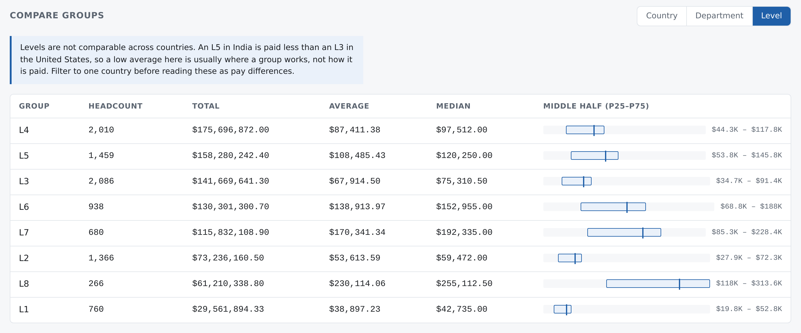
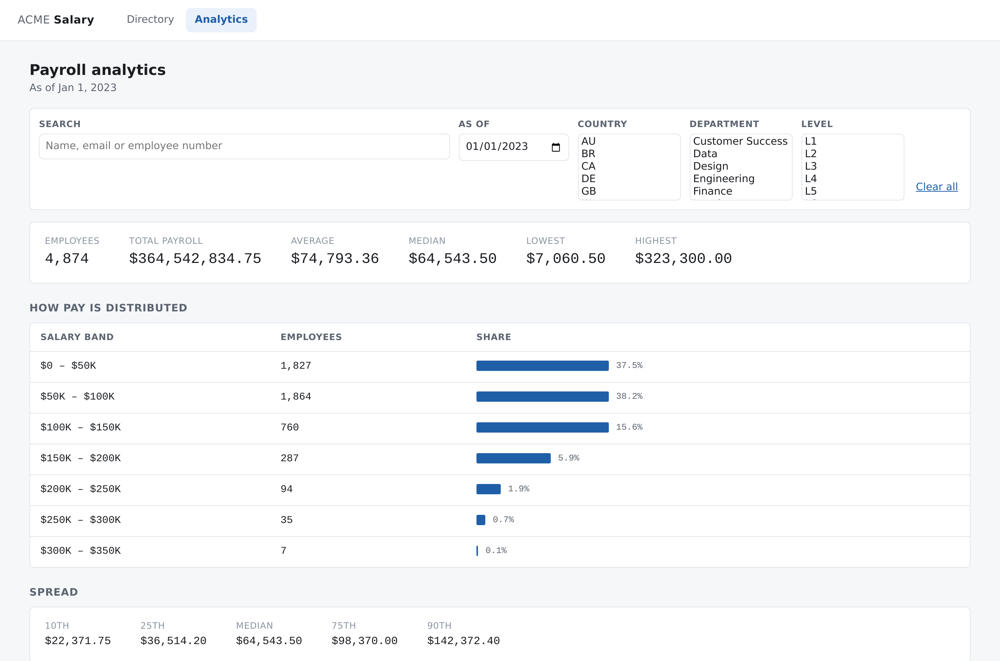

# Walkthrough

A tour of the running software. Every screenshot below was taken from the deployed app on
22 September 2026 — not a mockup, not local seed data dressed up for the camera.

**Live app:** <https://salary-management-web-xlv6.onrender.com>

The free Render instance sleeps after 15 minutes idle, so the first page load may take about a minute
to wake. Everything after that is quick.

---

## The directory

The landing page is the list an HR manager actually works from: roughly ten thousand people, searched,
filtered, sorted and paginated on the server.

Search runs against a trigram index, so two characters are enough and it still returns immediately.
Filtering, sorting and paging are all SQL — nothing ships ten thousand rows to the browser and sifts
them there.

Every filter lives in the query string. That is not a detail: it means one person can send another a
link to exactly the view they are looking at, and the browser's back button behaves the way everyone
already expects. The **Export CSV** button is the same URL with the page boundary removed, so the
download is always the list on screen — there is no second set of filters to keep in step.

## Money is not a number

Filter to Japan and the point of the money design becomes visible.

299 employees. Salaries read **¥46,770,000** — no decimal places, because the yen has no minor unit —
sitting beside **$299,328.00** in the base currency, which does. Every amount in the system is an
integer number of minor units travelling with its own currency code and its own exponent. Nothing is
stored in a float, and no part of the code has to guess what a bare number means.

The right-hand column is what makes the population comparable at all. Without it, "who are our ten
highest-paid people" is a question about exchange rates pretending to be a question about pay.

## One person, ten years

This is the core design decision, and the one I would defend hardest.

Pay is **effective-dated and append-only**. Each row is a period with a start and an end; the current
one is open-ended. Recording a change never edits an existing row — it closes the period that was
open and inserts a new one. So "what was this person earning in March 2019" and "what did payroll
cost last quarter" are the same query with a different date, and there is no month-end snapshot job
that has to keep running for history to survive.

Read the base-currency column down the page. Hired in 2015 on ¥11,650,000, which was **$106,015.00**.
Today on ¥33,950,000, which is **$217,280.00**. The yen figure nearly tripled; the dollar figure
roughly doubled — because the yen weakened across that decade.

That gap is deliberate. Each period is converted at the rate effective **on its own start date**, not
at today's rate, so historical figures stay reproducible: last year's report does not quietly change
because the exchange rate moved this morning. And because a converted amount can never change once
written, it was safe to store it on the row — which takes the rate lookup off the read path entirely.
The correctness argument and the performance win turn out to be the same decision.

## What it refuses to do

The most useful thing to show is not a feature. Here is an attempt to record a change dated
2025-08-02 — the day the current period began.

> a salary change must take effect after the current salary began on 2025-08-02

Backdating is refused. If a period could be inserted before the current one, there would be two
defensible answers to "what was this person paid in January", and every historical report would
depend on when you happened to run it.

This is not only a check in the service object. Postgres carries a GiST exclusion constraint that
makes overlapping periods for one employee physically unrepresentable, plus a partial unique index
allowing exactly one open-ended period per person. Two HR managers clicking submit in the same second
cannot corrupt the history — the loser is told to reload rather than shown a constraint name.

I also took the row lock *out* of the write path. `SELECT ... FOR UPDATE` cannot prevent a concurrent
insert of a row that does not exist yet, which is precisely the race that matters here; measured with
and without it, the loser failed identically. Leaving it in would have implied a protection it never
provided. The details are in [ADR-2 and ADR-4](architecture.md).

## Analytics

9,565 employees, **$885,788,558.93** of annual payroll, average **$92,607.27**, median
**$79,496.00**.

Both the average and the median are on screen on purpose. The gap between them is the whole story —
the mean is dragged upward by a long tail, and an HR manager shown only the average is being quietly
misled about what a typical person earns.

All of this is computed in SQL. Medians and percentiles are `percentile_cont` in Postgres, not ten
thousand rows loaded into Ruby and sorted there. The measurements are in
[docs/performance.md](performance.md).

## Comparing groups

This is the kind of question the spreadsheet could not answer. The United States: 2,853 people,
average $131,364.25. India: 2,115 people, average $36,713.90. The bar on the right is the middle half
of each group — p25 to p75 with the median marked — because two groups can share an average and still
pay their people completely differently.

Now group by level instead.

> Levels are not comparable across countries. An L5 in India is paid less than an L3 in the United
> States, so a low average here is usually where a group works, not how it is paid. Filter to one
> country before reading these as pay differences.

That paragraph is the part of this project I am most pleased with, and it is not a feature — it is a
sentence. Software that hands someone a number looking like a pay-equity problem, without saying that
it probably is not one, has done them a disservice. Refusing to answer badly is worth building.

## Time travel

Every figure takes an as-of date, because the history underneath it is real.

As of 1 January 2023: **4,874 employees**, **$364,542,834.75**, median **$64,543.50**. The company was
half the size and the top two distribution bands do not exist yet.

This is not today's salaries filtered by who happened to be employed then — it is what payroll
actually was on that date, reconstructed from the periods. That is the payoff for making pay
effective-dated in the first place.

## What is deliberately not here

Authentication and authorisation, payroll and tax, a live exchange-rate feed, bonus and equity,
approval workflows, and editing history in place. Each is listed as an explicit exclusion in
[docs/requirements.md](requirements.md), with the reasoning. Scope you have not written down is not
scope you have decided.

---

## How these screenshots were produced

`docs/images/` was captured by driving headless Chrome over the DevTools protocol against the
deployed URL, so the numbers are whatever the live database held that morning. Nothing was staged or
edited. The one interaction with side effects — submitting the salary form — was deliberately given a
backdated date, which the API rejects before writing anything, so capturing this walkthrough left the
data untouched.
